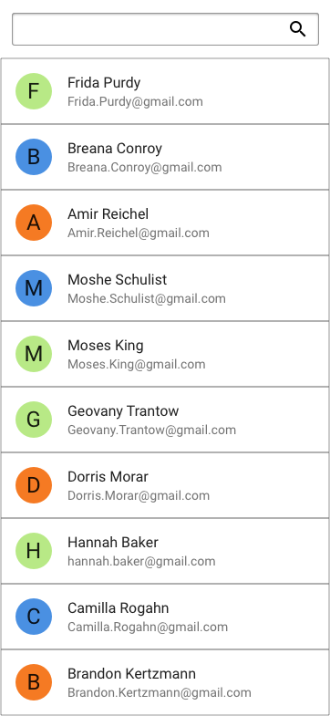
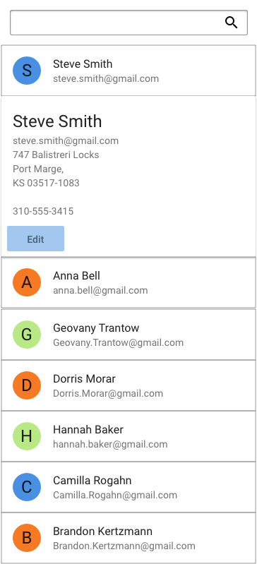
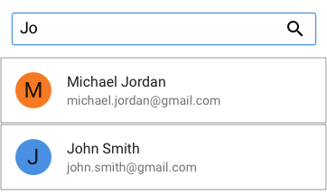

# Address Book Java

## Interview Preamble
The core of this challenge is to build features with a simple REST API using Spring Boot and a front end in angular. 
It's important to note, that we're not looking for completetion of the project, but rather a demonstration of your 
ability to solve problems. 
For convenience, we've included common libraries as part of the build, but their use is not required. 
Feel free to import any libraries you're comfortable with and resources like Google, StackOverflow, or 
documentation when completing this challenge.

## Requirements

- `nodejs` v18.19.1
- `jdk` v21

## Installation
- Backend
  - `cd backend`
  - `./gradlew build` (For windows use `gradlew.bat build`)
  - `./gradlew bootRun` (For windows use `gradlew.bat bootRun`)
- Frontend
  - `cd frontend`
  - `npm install`
  - `npm start`

For your convenience in the front end `package.json` we have included a command to start both of the processes together by running `npm run startAll` (`npm run startAllW` for windows).

## Task

The goal is to create an address book for managing and updating a list of contacts.
The app needs to have some basic functionalities

- the ability to see all your contacts (they do not need to be sorted alphabetically)
- the ability to edit a contacts information
- the ability to delete a contact
- the ability to search your contacts

We have some resources at our disposal, a set of (semi) complete wireframes from a designer, and a RESTFUL JSON api that implements search and pagination. The rest is up to you.
Feel free to get as complicated as you so desire, keeping in mind the time limit.

## Wireframes

Default State

After tapping a user, you should be able to hit edit, change their information and it saves and updates as well

Searching the address book,

 **note** this is not just a client side filter but instead needs to hit the db