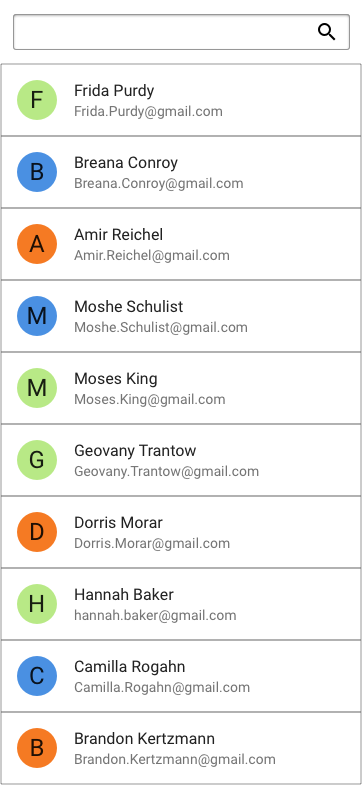
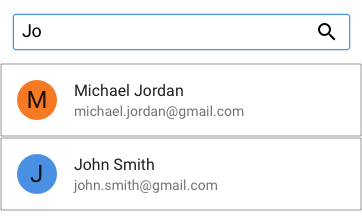

# Address Book

## Requirements

`nodejs` installed

to run the API server, `rails server -p 3001`.  You may first need to run `bundle install` or run it with `bundle exec rails server -p 3001`.

[API docs here](#api)

## Getting Started

3 Frameworks are setup and configured for use already.

### React

Create react app is setup in the `client-react` folder, you should be able to run `npm install`, `npm start` in there. I haven't ejected, feel free to eject if you need to

### Angular

ng-cli is set up with proxy server as well, its in the `client-ng` folder, `npm install`, `npm start` in there. I have not modified the starting config other than adding the proxy to the API

### Ember

Ember is set up with proxy server as well, its in the `client-ember` folder, `npm install`, `npm start` in there. I have not modified the starting config other than adding the proxy to the API

## Goals

The task is to create an address book for managing and updating a list of contacts.
The app needs to have some basic functionalities

- the ability to see all your contacts (they do not need to be sorted alphabetically)
- the ability to edit a contacts information
- the ability to delete a contact
- the ability to search your contacts

We have some resources at our disposal, a set of (semi) complete wireframes from a designer, and a RESTFUL JSON api that implements search and pagination. The rest is up to you.
Feel free to get as complicated as you so desire, keeping in mind the time limit.

## Wireframes

Default State

Searching the address book,

 **note** this is not just a client side filter but instead needs to hit the db

## Tips and Tricks

- The api takes an offset parameter. Implement either pagination, or some sort of infinite scroll.
- This design is just a general guideline of what the app needs to do, there are obviously gaps (editing state, delete state) that are missing from the wireframes, use your best judgement
- Search is crucial for the app. As of now, the api can only search on first and last name
- You can test the api by 

## API

2 endpoints

- GET `api/oddballs` accepts an optional `offset` query string parameter and returns 100 people.
- GET `api/oddballs/:id`, returns information for a specific oddball
- GET `api/search` requires a `q` query string parameter and returns oddballs whose first or lastname fuzzy matches that query

All endpoints return json
