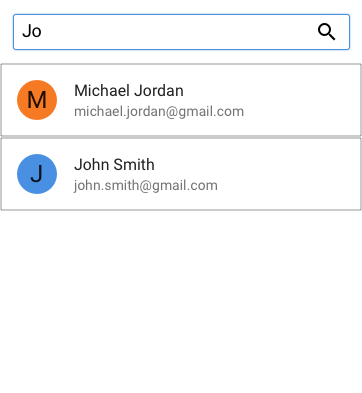

# Address Book

## Requirements

nodejs installed

to run the API server, `npm install`, `npm start`

[API docs here](#API)

## Getting Started

2 Frameworks are setup and configured for use already, feel free to also do the challenge in Vuejs or Knockout/Backbone if you can set things up
Create react app is setup in the `client-react` folder, you should be able to run `npm install`, `npm start` in there
ng-cli is set up with proxy server as well, its in the `client-react` folder, `npm install`, `npm start` in there

## Goals

The task is to create an address book for managing and updating a list of contacts.
The app needs to have some basic functionalities

- the ability to see all your contacts (they do not need to be sorted alphabetically)
- the ability to edit a contacts information
- the ability to delete a contact
- the ability to search your contacts

We have some resources at our disposal, a set of (semi) complete wireframes from a designer, and a RESTFUL JSON api that implements search and pagination. The rest is up to you.
Feel free to get as complicated as you so desire, keeping in mind the timelimit. 

## Wireframes

Default State

After tapping a user, you should be able to hit edit, change their information and it saves and updates as well

Searching the address book, **note** this is not just a client side filter but isntead needs to hit the db

## Tips and Tricks

- The api takes an offset parameter. Implement either pagination, or some sort of infinite scroll.
- This design is just a general guideline of what the app needs to do, there are obviously gaps (editing state, delete state) that are missing from the wireframes, use your best judgement
- Search is crucial for the app but as of now, the api can only search on first and last name
- You can test the api by 

## API

2 endpoints

- GET `api/oddballs` accepts an optional `offset` query string parameter and returns 100 people.
- GET `api/search` requires a `q` query string parameter and returns oddballs whose first or lastname fuzzy matches that query
- PUT `api/oddballs/:id`, updates an oddballs information in the DB

All endpoints return json and the PUT and POST endpoints accept json
